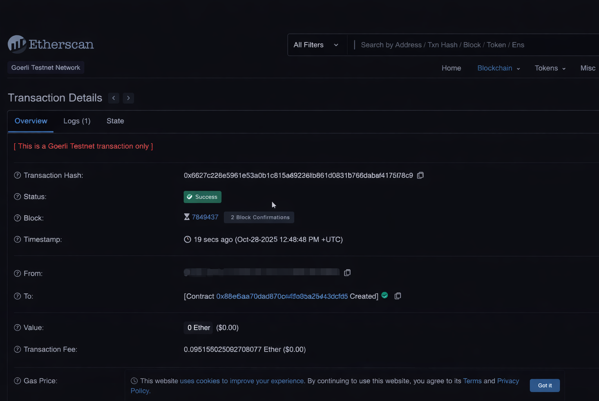

# Creating Your First Token from Scratch Using Web3 Standards

Project developed at the Bootcamp Blockchain Specialist Training, under the guidance of specialist [Ricardo Zago](https://www.linkedin.com/in/ricardozago/ "Ricardo Zago").
Learn how to create a token from scratch. To do this, it's important to configure the Metamask wallet and RPC information. Then, using the source code and instructions, make the necessary changes and use the REMIX IDE to deploy the token.

Technologies used:

- [Solidity](https://www.soliditylang.org/)
- [Remix IDE](https://remix.ethereum.org/#lang=en&optimize&runs=200&evmVersion&version=soljson-v0.8.34+commit.80d5c536.js)
- [Metamask](https://chromewebstore.google.com/detail/metamask/nkbihfbeogaeaoehlefnkodbefgpgknn)

Useful links:

- [Default download token (Version 0.4.24):](https://academiapme-my.sharepoint.com/:t:/g/personal/renato_dio_me/ERurYEjAXLZFhtF9CWrk_7YBUw4Me9_pQ7idwhfgpNcXmg?e=V2huVF)
- [Github with default token for download (latest version)](https://github.com/relsi/web3-blockchain-classes/blob/main/token.sol)
- [Metamask](https://metamask.io/)
- [RCP](https://rpc.info/)
- [Remix IDE](https://remix.ethereum.org/)

Transations details:

[LICENSE](/LICENSE)

See [original repository](https://github.com/relsi/web3-blockchain-classes/blob/main/token.sol)
